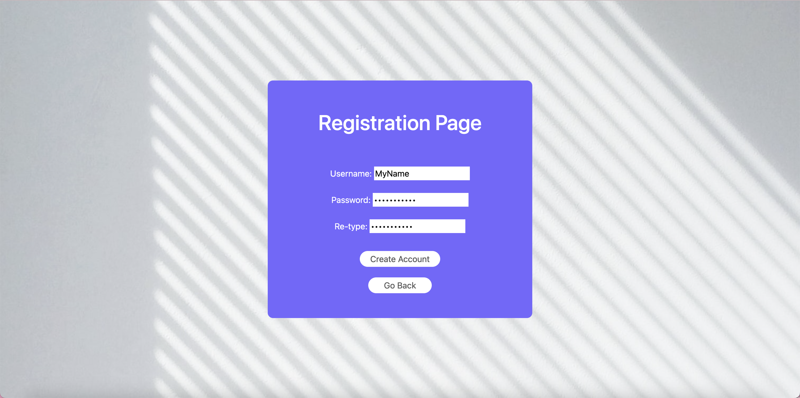
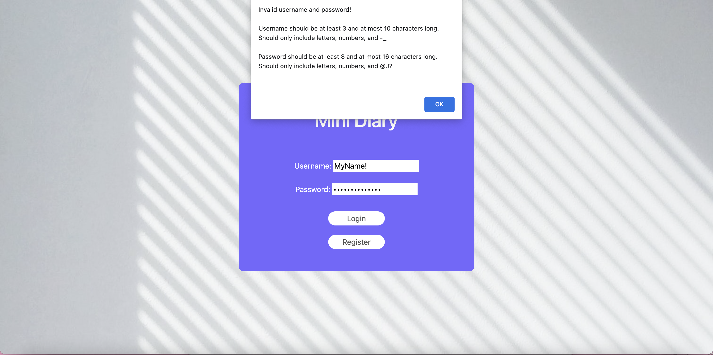
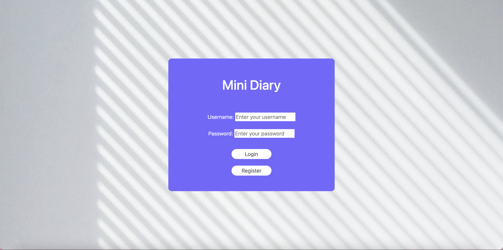
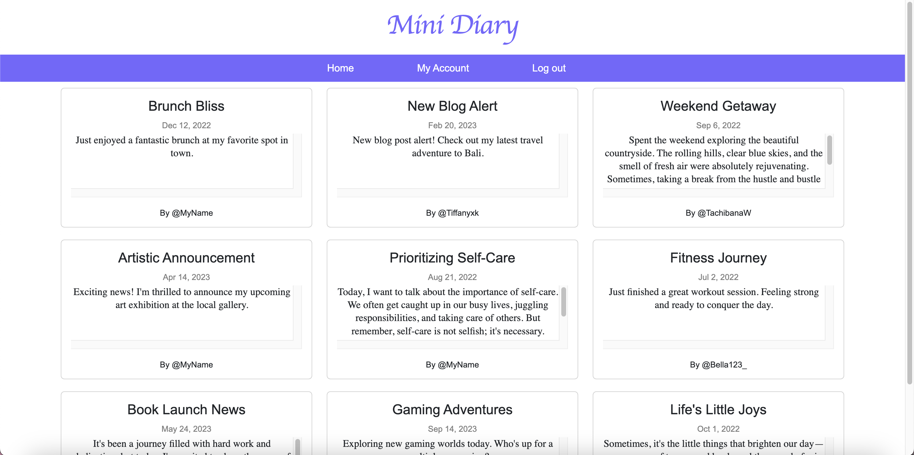

// Very clear and well-structured! It might be a good idea to add the slide link and video link :)


# MiniDiary

> Author: Naiyi Zhang & Yunke Nie
>
> Course Link: [https://johnguerra.co/classes/webDevelopment_fall_2023/](https://johnguerra.co/classes/webDevelopment_fall_2023/)

## Project Objective

### Description

A simple webpage acts like a blogging platform, allowing users to perform basic operations like creating, reading, updating, and deleting. We will implement fake authentication for user management

### User persona & stories

1. Nigel is a 23-year-old graduate student. He is a careless person and keeps forgetting what he needs to do. Under his daily workload, he needs a convenient platform to record TODOs or some diary for him to check in the future.
   - As Nigel, I want to create a new diary entry so that I can write down something easily.
   - As Nigel, I want to check my past diary entries by date or title to make sure I can get those reminders.
2. Bella is a skilled and dedicated software engineer with a demanding workload. She wants to relax and destress.
   - Bella wants to relax after intense work schedules by browsing some interesting posts.
   - Bella wants to find like-minded communities, and interact and connect with people who share the same hobby and passion.
3. Caroline is enthusiastic about cooking. As she studied abroad, she developed her own recipe which is always complimented by her friends.
   - Caroline wants a platform to share her cooking procedures and unique recipes.
   - Caroline wants to learn more techniques in cooking and new dishes.

### Functionalities

- [x] Account management: allows users to sign up, log in, and log out.
- [x] Creating posts: allows users to create posts with text.
- [x] Reading posts: allows users to browse all posts made by others.
- [x] Updating posts: allows users to update their own posts.
- [x] Deleting posts: allows users to delete existing posts made by themselves.
- [x] Sorting posts by date ascending or descending.

### Technology & Framework
- HTML
- CSS
- Bootstrap
- JavaScript
- Express.js
- Node.js
- Nodemon
- body-parser
- Prettier
- ESLint

## Screenshots






## Instruction to build

After cloning the repository, run the following commands in the root directory of the project:

```
npm install
npm start
```

